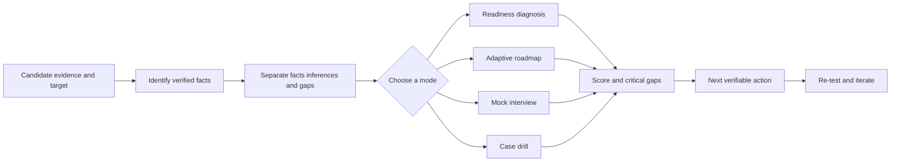

# fde-interview

[简体中文](README.md) · **v0.1.0**

An evidence-first interview and career-preparation Skill for Forward Deployed
Engineer, Forward Deployed AI Engineer, FDSE, Applied AI, AI Solutions,
Customer Engineering, and adjacent technical-delivery roles.

> **Do not just memorize Agent terminology. Prove that you can discover a real
> problem, deliver a production system, drive adoption, and turn field learning
> into reusable capability.**

## Four core modes

| Mode | What you get | Example |
| --- | --- | --- |
| 🔍 Readiness Diagnosis | Strengths, evidence gaps, and critical risks based on your background, target role, region, level, and timeline | “I am a Java backend engineer moving toward an AI FDE role” |
| 🗺️ Adaptive Roadmap | A 14-day, 28-day, 6–8 week, or custom plan prioritized by real gaps | “Build me a 28-day transition roadmap” |
| 🎤 Mock Interview | One question at a time across project depth, Discovery, system design, production, and value | “Interview me for a Senior Forward Deployed AI Engineer role” |
| 🏭 FDE Case Drill | Ambiguous customer scenarios with evidence revealed in stages | “Give me a manufacturing maintenance Agent case without revealing the answer” |

The Skill also supports evidence-aware resume improvement and a dual-track score:
a universal 100-point core plus China enterprise-delivery or international
platform overlays.

## Workflow



The Skill does not invent customers, ownership, metrics, or production status.
Missing evidence is labeled as a gap instead of being polished into a claim.

## Who it is for

- Software, infrastructure, data, ML, and AI/Agent engineers;
- Solutions engineers, implementation specialists, technical consultants, and
  customer engineers;
- Product, operations, customer-success, business, and domain professionals;
- Candidates moving from adjacent roles or beginning to explore FDE work.

## Quick start

### Clone

```bash
git clone https://github.com/XiaoLeng-master/fde-interview-skill.git fde-interview
cd fde-interview
```

### Validate

```bash
python3 scripts/validate_skill.py .
python3 -m json.tool evals/trigger-cases.json >/dev/null
python3 -m json.tool evals/quality-cases.json >/dev/null
python3 -m json.tool evals/adversarial-cases.json >/dev/null
```

### Copy / install / reload

Copy the complete `fde-interview` directory into the Skill location required by
your host. Do not copy only `SKILL.md`; the references, evaluation fixtures, and
validator are part of the package. Reload Skills according to the host's
instructions.

### Smoke test

After loading the Skill, send:

```text
I have five years of Java backend experience and want to move into an AI FDE
role. Diagnose my readiness.
```

Expected behavior: the Skill enters Readiness Diagnosis, separates known
evidence from gaps, and asks at most one question that materially changes the
assessment.

## Example prompts

```text
Use this job description and sanitized resume to produce China-focused and
international FDE versions.
```

```text
Mock interview me for a Senior Forward Deployed AI Engineer role in English.
```

```text
Give me an FDE case about a manufacturing equipment-maintenance Agent. Do not
reveal the answer in advance.
```

## Repository structure

```text
fde-interview/
├── SKILL.md
├── CONTRIBUTING.md
├── references/       # roles, scoring, resumes, interviews, cases, and sources
├── evals/
│   ├── README.md
│   ├── trigger-cases.json
│   ├── quality-cases.json
│   └── adversarial-cases.json
└── scripts/validate_skill.py
```

The fixtures are platform-neutral manual checks. They do not prescribe a runner,
model, or scoring API. The validator checks file structure and JSON shape;
evaluators must judge responses against each fixture's assertions.

## Contributing

Read [CONTRIBUTING.md](CONTRIBUTING.md). Sanitized cases, publicly verifiable
sources, and manual evaluation fixtures are welcome.

Do not submit personal data, customer names, credentials, internal links,
NDA-protected material, or unverified metrics and ownership claims.

## Support the project

If this Skill helped you understand FDE work, identify a real readiness gap, or
complete a useful practice session:

- **Star the repository** to follow future cases and releases.
- Share a sanitized transition scenario.
- Report a routing failure, unreasonable score, or missing follow-up question.
- Contribute a publicly verifiable source or evaluation fixture.

If it did not help, say where it failed. A real counterexample is more valuable
than an output that merely looks professional.

## Boundaries

- No promise of an offer, compensation, or a short-term career transition.
- No invented customers, ownership, metrics, or production status.
- AI Agents are not treated as the only valid technical direction for FDE work.
- This open-source method is not presented as any company's official interview
  standard.
- Time-sensitive roles, hiring processes, products, and compensation must be
  re-verified.

## License

MIT. Third-party sources retain their original copyright and licenses; this
repository does not redistribute restricted source material.
