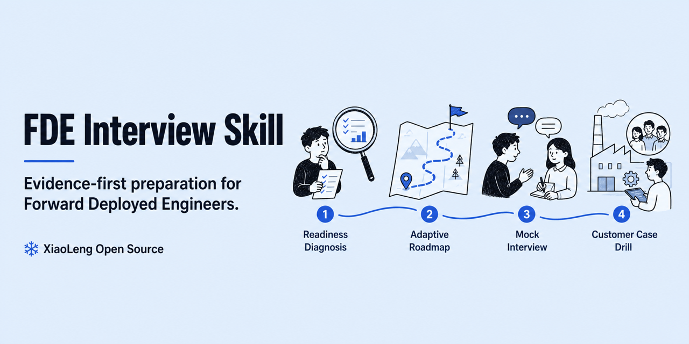
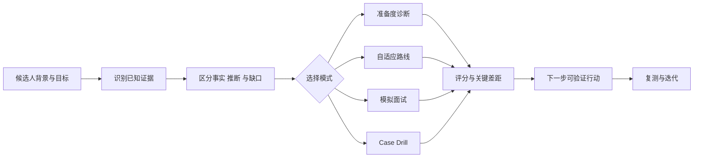

# fde-interview



[](https://github.com/XiaoLeng-master/fde-interview-skill/actions/workflows/validate.yml) [](https://github.com/XiaoLeng-master/fde-interview-skill/releases/latest) [](LICENSE)

[English](README.en.md) · **v0.1.0**

一个通用的 Forward Deployed Engineer 求职与面试 Skill，面向 FDE、Forward Deployed AI Engineer、FDSE、Applied AI、AI 解决方案工程师、客户工程和技术交付等相邻岗位。

> **不只背 Agent 名词，而是用证据证明你能找到真实问题、交付生产系统并推动采用。**

## 四种核心模式

| 模式 | 你会得到什么 | 示例入口 |
| --- | --- | --- |
| 🔍 准备度诊断 | 基于背景、JD、地区、级别和期限识别优势、证据缺口与关键风险 | “我做了 5 年 Java 后端，想一个月内转国内 AI FDE” |
| 🗺️ 自适应路线 | 14 天、28 天、6–8 周或自定义计划，并按真实缺口调整优先级 | “给我一份 28 天转型路线” |
| 🎤 模拟面试 | 一次只问一个问题，覆盖项目、Discovery、系统设计、生产和价值 | “模拟 Senior Forward Deployed AI Engineer 面试” |
| 🏭 FDE Case Drill | 通过分阶段隐藏证据模拟模糊客户现场 | “给我一个制造企业设备维修 Agent Case” |

此外还支持证据优先的简历优化，以及通用 100 分＋国内企业交付／国际平台 Overlay 的双轨评分。

## 工作流程



Skill 不会替候选人虚构客户、Ownership、指标或生产状态。证据缺口会被明确标记，而不是被包装成事实。

## 适用背景

- 技术：Software、Infrastructure、Data、ML、AI/Agent Engineer；
- 交付、咨询与客户工程：Solutions Engineer、Implementation、Technical Consultant；
- 产品、业务、客户成功、运营与行业/领域专家；
- 希望从相邻岗位转型，或刚开始探索 FDE 的候选人。

## 快速开始

### Clone

```bash
git clone https://github.com/XiaoLeng-master/fde-interview-skill.git fde-interview
cd fde-interview
```

### 验证

```bash
python3 scripts/validate_skill.py .
python3 -m json.tool evals/trigger-cases.json >/dev/null
python3 -m json.tool evals/quality-cases.json >/dev/null
python3 -m json.tool evals/adversarial-cases.json >/dev/null
```

### Copy / install / reload

将整个 `fde-interview` 目录复制或安装到宿主要求的 Skills 目录；不要只复制 `SKILL.md`，否则参考资料、评测夹具和验证器会缺失。随后按宿主说明重新加载 Skills。

### Smoke test

加载后发送：

```text
我做了 5 年 Java 后端，想一个月内转国内 AI FDE，帮我诊断。
```

预期：Skill 进入“准备度诊断”，先识别已知证据与缺口，并且至多追问一个会影响判断的问题。

## 使用示例

```text
根据这份 JD 和脱敏简历，给我生成国内版和国际版 FDE 简历。
```

```text
模拟面试我：目标是 Senior Forward Deployed AI Engineer，全英文。
```

```text
给我一个制造企业设备维修 Agent 的 FDE Case，不要提前给答案。
```

## 目录

```text
fde-interview/
├── SKILL.md
├── CONTRIBUTING.md
├── references/       # 角色、评分、简历、题库、Case 和来源
├── evals/
│   ├── README.md                 # 手工评测夹具说明
│   ├── trigger-cases.json        # 路由与澄清检查
│   ├── quality-cases.json        # 四种模式的质量检查
│   └── adversarial-cases.json    # 安全、隐私与证据边界检查
└── scripts/validate_skill.py
```

评测夹具是平台中立的手工检查，不规定 runner、模型或评分 API。验证器只检查文件结构与 JSON 形状；评估者需要依据每个 fixture 的 assertions 人工判断响应是否通过。

## Roadmap

请查看 [公开 Roadmap](ROADMAP.md)，了解 v0.1.x、v0.2.0 与长期方向。Roadmap 表达方向，不代表已经交付。

## 贡献

请阅读 [CONTRIBUTING.md](CONTRIBUTING.md)。欢迎补充脱敏案例、可公开核验的来源和手工评测夹具。

请勿提交个人信息、客户名称、凭证、内部链接、受保密协议约束的材料，或未经证实的指标与 Ownership 表述。

## 支持这个项目

如果这个 Skill 帮你更清楚地理解 FDE、发现了真实准备缺口，或完成了一次有价值的模拟练习：

- **Star 本仓库**，关注后续案例和版本。
- 提交一个经过脱敏的真实转型场景。
- 反馈一次失败路由、不合理评分或缺失的面试追问。
- 贡献可公开核验的岗位资料与评测夹具。

如果它没有帮到你，请直接说明哪里失效。真实反例比“看起来很专业”的输出更有价值。

## 设计边界

- 不承诺 Offer、薪酬或短期转岗结果。
- 不虚构客户、Ownership、指标或生产状态。
- 不把 AI Agent 当成所有 FDE 岗位的唯一技术方向。
- 不把开源方法冒充任何公司的官方面试标准。
- 岗位、公司流程、产品版本和薪酬等时效信息需要重新核验。

## License

MIT。引用的第三方资料保留各自版权和许可证；本仓库不重新分发受限制的原文材料。
